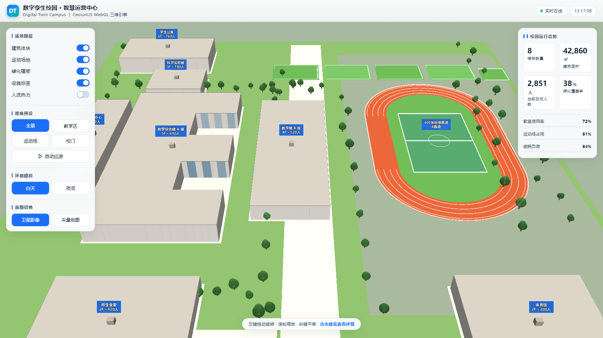

# 数字孪生校园 · Digital Twin Campus

基于 **CesiumJS** 构建的校园三维数字孪生可视化单页应用。参照校园卫星影像图，用代码程序化建模还原校园的空间布局，支持交互浏览、分层查看和实时数据展示。

整个项目就是**一个 HTML 文件**，无需构建、无需安装依赖。



---

## 主要功能

### 三维场景建模

场景全部由代码生成，不依赖外部模型文件：

| 要素 | 说明 |
|---|---|
| 建筑体块 | 8 栋建筑，用多边形拉伸（`extrudedHeight`）生成体量 |
| 400 米标准跑道 | 带孔多边形挖空内场，含分道线、中点圈、球门区 |
| 足球场 | 标准场地白线 + 中圈 + 罚球区 |
| 室外球场 | 5 片，含篮球场、网球场 |
| 绿化植被 | 树木（圆柱树干 + 双层椭球树冠）成排布置 |
| 道路铺装 | 校园环路、主次干道、广场铺装 |

**建筑清单**

| 建筑 | 用途 | 规模 |
|---|---|---|
| 教学综合楼 A 座 | E 字形主楼 · 高中部 | 5F · 640 人 |
| 教学楼 B 座 | 初中部 | 4F · 520 人 |
| 科学实验楼 | 理化生实验室 | 3F · 180 人 |
| 图书行政中心 | 图书馆 · 校务办公 | 4F · 120 人 |
| 师生食堂 | 可容纳 1200 人就餐 | 2F · 420 人 |
| 学生体育馆 | 篮球 · 羽毛球 | 2F · 200 人 |
| 学生公寓 | 6 层 · 200 间 | 6F · 760 人 |
| 南门 · 门卫室 | 出入口 · 人脸识别闸机 | — |

### 交互功能

- **点击建筑** —— 高亮选中、弹出信息卡（层数 / 面积 / 容纳人数）、相机自动聚焦
- **视角预设** —— 全景、教学区、运动场、校门、自动巡游（绕校园环飞）
- **场景图层开关** —— 建筑体块、运动场地、绿化植被、设施标签、人流热力，可独立显隐
- **昼夜切换** —— 白天 / 夜间光照模式
- **底图切换** —— 高德卫星影像 / 矢量路网
- **实时数据看板** —— 建筑数量、占地面积、在校人数、绿化率等指标动态展示

### 稳定性设计

- **环境自检** —— 启动时检测 WebGL 支持与显卡渲染模式，异常时给出明确提示
- **渲染健康检查** —— 轮询采样绘制命令，长时间无输出才报警（避免加载期误报）
- **离线兜底瓦片** —— 底图加载失败时铺一层程序化生成的垫底纹理，不会出现黑屏
- **CDN 双源兜底** —— Cesium 主库走 jsdelivr，失败自动切 unpkg

---

## 快速开始

### 方式一：一键启动（Windows）

双击 **`启动校园.bat`**。脚本会自动定位 Python、启动本地服务并打开浏览器。

### 方式二：手动启动

```bash
# 在本目录下执行
python -m http.server 8899 --bind 127.0.0.1
```

然后浏览器访问 <http://127.0.0.1:8899/index.html>

> **⚠️ 不要直接双击 `index.html`**
>
> 浏览器在 `file://` 协议下会拦截 Cesium 依赖的 Web Worker 与贴图资源，导致整个三维场景无法渲染 —— 表现为只有背景星空和文字标签，建筑和地面全部消失。
>
> 这是浏览器的安全策略，不是代码问题。**必须通过 HTTP 服务访问。**

---

## 技术实现

### 技术栈

- **CesiumJS 1.119** —— 三维地理引擎
- **原生 JavaScript** —— 无框架、无构建步骤
- **高德地图瓦片** —— 国内直连、无需申请 Key

### 关键设计

**局部平面坐标系建模**

为了便于按参考图布局，整个校园建立在一个以米为单位的局部平面坐标系上，再统一转换为经纬度：

```js
const ORIGIN = { lon: 118.0894, lat: 24.4798 };  // 校园基准点
const M_PER_DEG_LAT = 111320;   // 每度纬度对应的米数
const M_PER_DEG_LON = 101313;   // 该纬度下每度经度对应的米数

function toCarto(x, y, h = 0) {
  return Cesium.Cartesian3.fromDegrees(
    ORIGIN.lon + x / M_PER_DEG_LON,
    ORIGIN.lat + y / M_PER_DEG_LAT,
    h
  );
}
```

这样建模时可以直接写"教学楼在中心点西侧 95 米"，无需处理经纬度。

**跑道几何**

400 米标准跑道是胶囊形（两个半圆 + 直道），用带孔多边形实现中间挖空：

```js
new Cesium.PolygonHierarchy(outerRing, [new Cesium.PolygonHierarchy(innerRing)])
```

**底图图层管理**

底图切换时保留 index 0 的离线垫底层，只替换上层的在线瓦片：

```js
while (layers.length > 1) layers.remove(layers.get(1), true);
layers.addImageryProvider(which === 'street' ? providerStreet : providerSatellite);
```

---

## 项目结构

```
.
├── index.html          # 全部应用代码（HTML + CSS + JS 单文件）
├── 启动校园.bat        # Windows 一键启动脚本
└── .gitignore
```

---

## 浏览器要求

| 项目 | 要求 |
|---|---|
| 浏览器 | Chrome / Edge 最新版（需支持 WebGL 2.0） |
| 硬件加速 | **必须开启**（设置 → 系统 → 使用硬件加速模式） |
| 网络 | 用于加载 Cesium 库与地图瓦片 |

如果页面无法正常显示，参考上述「快速开始」中的说明，确认是通过 HTTP 服务访问的。

---

## 许可

仅供学习与演示使用。
